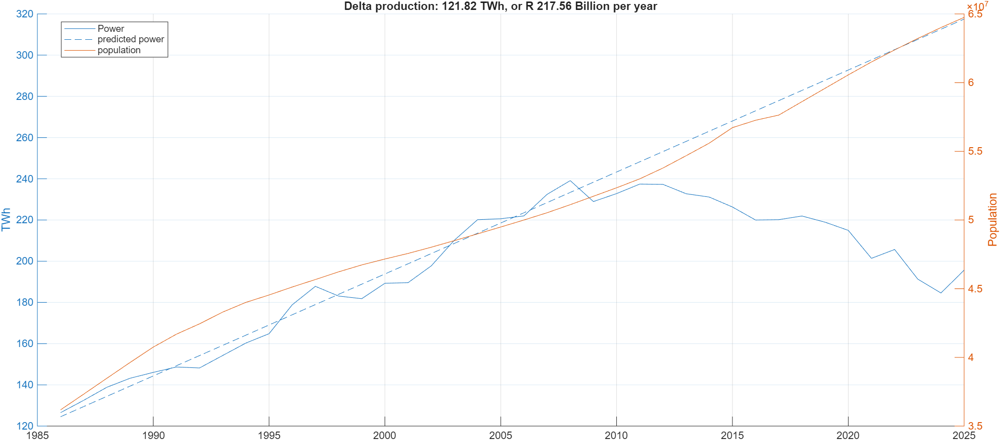

# Eskom losses / SA private power production 
This is just here to document the power production of Eskom and how it has dropped since load-shedding times. This is due to the installation 
of green power sources, such as solar.

# Data collection
Collecting this type of data is not the easiest since 1984. If anyone has more data, please share.  
This data has so far been found and extracted by ChatGPT. 

# Cost estimate and fun details
- Eskom lost approximately R217 billion in 2026
- Eskom should be producing  121 TWh extra.

This implies SA is producing about 121 TWh privately.  
Check out the Eskom (daily power prodcution)[https://www.eskom.co.za/dataportal/supply-side/station-build-up-for-the-last-7-days/], and compared it to. 

